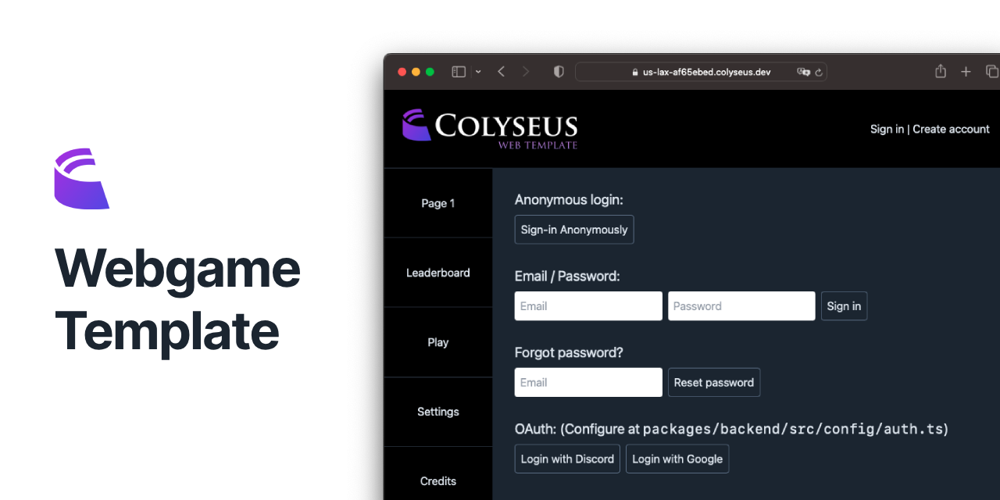

# Colyseus Webgame Template

---

**[See it in action! :rocket:](https://us-lax-af65ebed.colyseus.dev)**

Feel free to fork this template to build your own multiplayer web-game.

> This is a demonstration of the new `@colyseus/auth` package. ([See documentation](https://docs.colyseus.io/authentication/module/))

**Backend**

- `colyseus` → Multiplayer Framework
- `@colyseus/auth` → Authentication (Email/Password, OAuth, Anonymous)
	- "Forgot password" emails are sent using [Resend](https://resend.com/) (See [source-code](https://github.com/endel/colyseus-auth/blob/cfd70dc498fa2c4c83873dac25a16b22e26004a0/packages/backend/src/config/auth.ts#L40-L47))
- `@colyseus/database` → (Experimental) Kysely-powered database module

See the authentication configuration: [`packages/backend/src/config/auth.ts`](/packages/backend/src/config/auth.ts)

**Frontend**

- `react` → UI library
- `react-router-dom` → Navigation
- `tailwindcss` → CSS Framework
- `vite` → Build tool

Contributions for additions and improvements on this template are very welcome!

---

## Looking the backend configuration example?

- The environment secrets are defined at [`packages/backend/.env.development`](packages/backend/.env.development)
- The `@colyseus/auth` callbacks are defined at [`packages/backend/src/config/auth.ts`](packages/backend/src/config/auth.ts)

## License

MIT

